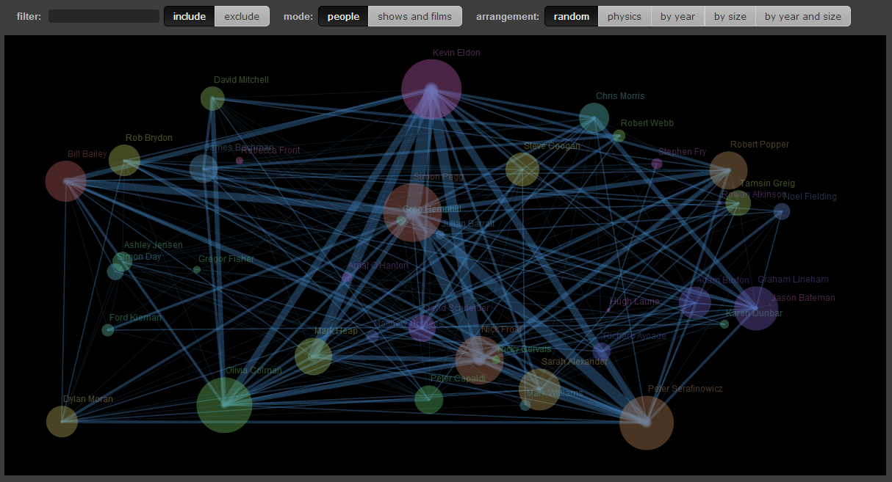

Comedy-Connections
==================

A visualisation of the interconnections between comedy actors and shows/films. View it here: <a href="https://stevenblair.github.io/comedy-connections/">https://stevenblair.github.io/comedy-connections/</a>.

Open `index.html` in a browser. All scripts are local; no installation or build is required.

`sketch.js` is the browser version of `traer.pde` and `ComedyConnections.pde`.

GitHub Pages publishes the repository root on `master`. `.nojekyll` serves the static files without Jekyll processing.

To run the browser regression checks, serve this directory with `python -m http.server 8000`, then open `http://localhost:8000/tests/browser.html`. The checks cover idle redraws, hover, dragging, filters, layouts, responsive controls, resizing, and physics.
